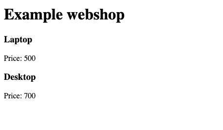

## Week 14 Quiz - Debugging, Git, & GitHub

### Demo of the App



You've just joined your favorite company and have been tasked with printing new data to a webpage. However, the existing files and directories are disorganized, and the code has several bugs. Your job is to fix the bugs and restructure the file system.

### Bug Fixing Process

1. **Fixing item rendering in `App.js`**  
   In `App.js`, on lines 16 to 17, I changed `'items'` to `'item'` to ensure each item renders correctly.

2. **Restructuring the file structure**  
   The `server` folder was incorrectly placed inside the `client` folder. To fix this, I moved it to the correct location by following these steps:

   ```bash
   cd Desktop
   mkdir app
   mv client app/
   mv app/client/server app/
   ```

   After restructuring, the project directory looks like this:

   ```
   app/
   ├── client/
   └── server/
   ```

3. **Ignoring `node_modules`**  
   The `node_modules` directory was mistakenly committed to the repository. To prevent tracking it in the future, I added `node_modules` to the `.gitignore` file.

4. **Removing and Re-adding Git Remote**  
   To switch to a new repository, I first removed the existing Git remote with:

   ```bash
   git remote remove origin
   ```

   Then, I reinitialized the repository, added a new remote, and pushed the changes:

   ```bash
   git init
   git remote add origin <my_repo_url>
   git add .
   git commit -m "Initial commit"
   git push -u origin main
   ```